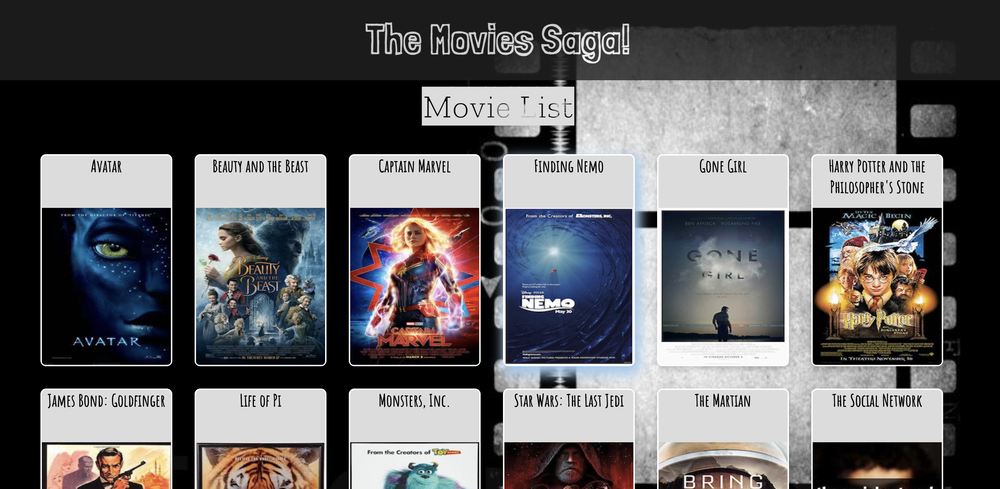
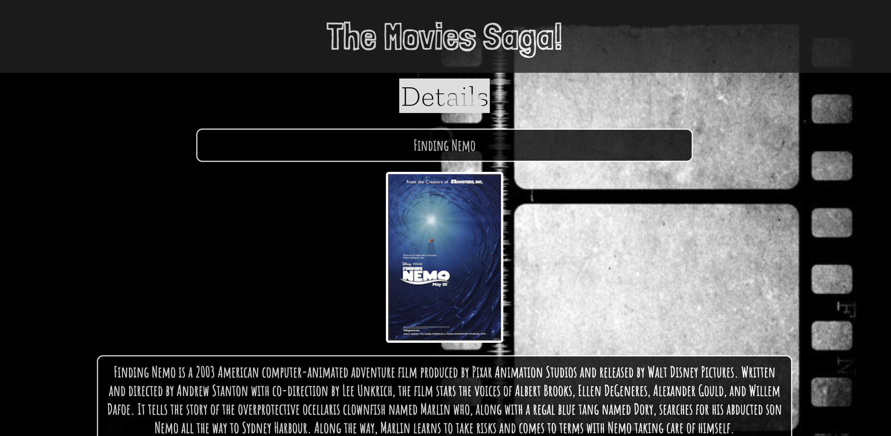
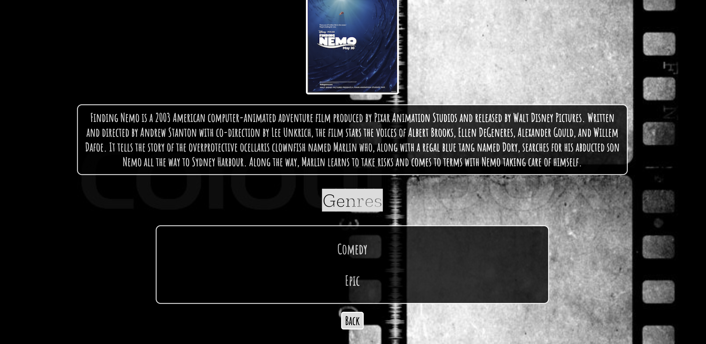

# The Movies Saga
Do you like movies and do you like clicking on things? Get ready for the best of both worlds! Here is a great API where you can click on movies and see their descriptions! Also you can see what genre they belong to too! It's so great you could explode with happiness, but we don't recommend that! Instead, just keep clicking!!!!

[Project Instructions](./INSTRUCTIONS.md)

## Description
This API uses react, redux and saga. It uses dispatch for client side communication and axios for sending data from client to server side.  It uses pg for connecting with an outside database in Postico.  Using reducers the data can be stored and grabbed in house with useSelectors. The 'movie posters' and 'back' button uses usehistory for navigation. HashRouter and Route are both used for displaying components to the DOM. All styling was done with css.

Additional README details can be found [here](https://github.com/PrimeAcademy/readme-template/blob/master/README.md).
